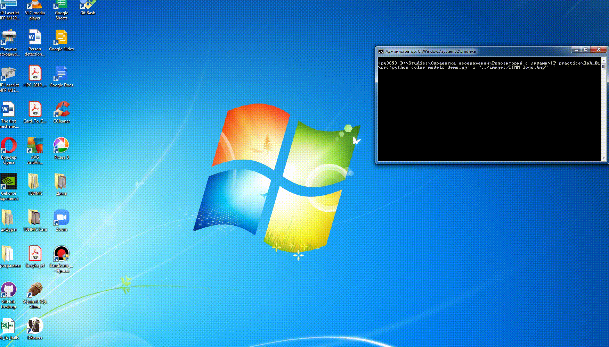
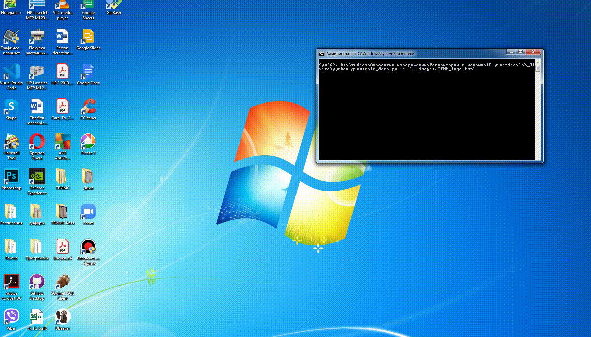

# Инструкция к запуску демо
```bash
python <name>_demo.py
```
### Обязательные параметры:
* `-i / --input` - путь до изображения

## Демонстрация запуска демо
### brightness_demo


### color_models_demo


### grayscale_demo
