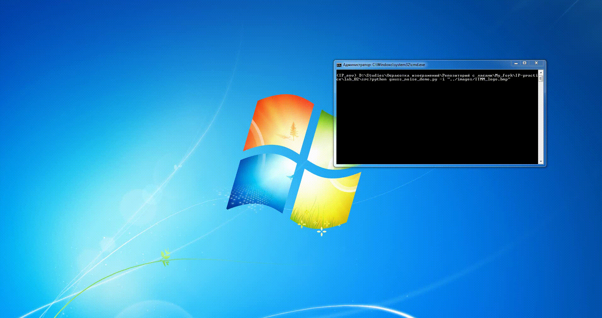

# Инструкция к запуску демо
```bash
python <name>_demo.py
```
### Обязательные параметры:
* `-i / --input` - путь до изображения
...

## Демонстрация запуска демо
### Запуск gauss_noise_demo.py


### Запуск gauss_denoising_demo.py


### Запуск midpoint_filter_denoising_demo.py
